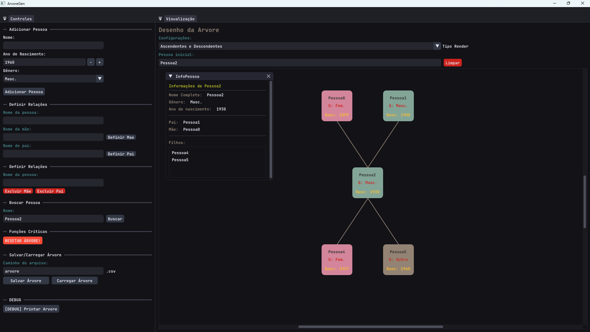

# Aplicativo de Árvore Genealógica

- Projeto feito por Emanuel e Gabriel para a disciplina de Linguagem de Programação (2º semestre) do curso de ADS no IFRS



<small>Foto do estado atual do projeto (05/11/2025)</small>

## Documentação

Docs detalhados no arquivo [Documentacao.md](docs/Documentacao.md)  

## Enunciado do Trabalho

```
Objetivo: Implementar um sistema em C++ para representar e manipular uma árvore genealógica, aplicando estruturas de dados hierárquicas, como árvores, ou listas e filas.

Implementar um sistema em C++ para representar e manipular uma árvore genealógica, aplicando estruturas de dados hierárquicas, como árvores, ou listas e filas.

Funcionalidades obrigatórias

- Adicionar pessoa (nome, ano de nascimento, gênero).
- Definir relação entre duas pessoas (pai/mãe e filho).
- Exibir descendentes e ascendentes de uma pessoa.
- Listar toda a árvore a partir de um ancestral principal.
- Buscar pessoa por nome.

Funcionalidades opcionais

- Exibir nível de parentesco entre duas pessoas (distância em nós).
- Contar o número de descendentes diretos e indiretos.
- Mostrar gerações separadas por nível.
- Gravar e carregar a árvore de um arquivo texto.
```

---

## Como Rodar o Projeto

- **Visando facilitar o processo para o professor, na branch `build` foi feito o upload da pasta build com o executável já buildado.**

Faça o download do projeto (branch build), [clicando aqui!](https://github.com/gabohs/ArvoreGen/archive/refs/heads/build.zip)

---

se o link não funcionar (é pra funcionar 100% de certeza), mas caso não funcione: clique no botão azul `Code` e depois em `Download ZIP`. Certifique-se de que está na branch `build`


---

ou, clone com o git rodando no terminal o comando:

```sh
git clone --recursive https://github.com/gabohs/ArvoreGen.git
```

<small> <small>OBS: --recursive é necessário para clonar também o repositório do GLFW (biblioteca usada para gerenciar o contexto OpenGL), que é tratado como um submódulo neste projeto</small> </small>

Após isso, vá até:

> build\Debug\Debug\
 
ou, se quiser a versão release:

> build\Release\Release\

e rode **ArvoreGen.exe**

### Rodando do zero

> [!WARNING]
> Para realizar o processo de build do zero é necessário ter [CMake](https://cmake.org/download/) instalado

1. Faça o download do projeto como mostrado acima.
2. Rode os scripts .bat em ordem: (**s1**; depois o **s2**; e depois rode o **s3** desejado)
